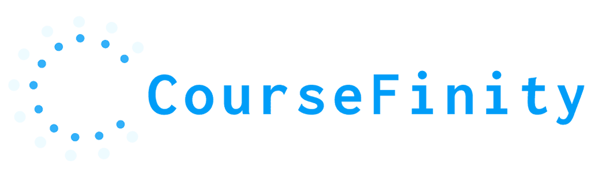

<h1 align="center">

<br>
CourseFinity Web Application using Flask
<br>
(Requires Python 3.10 and above)
</h1>

---

## Forked Project for IT2555 App Security Project [4 members]

This project consists of us making a SECURE web application using Flask as its framework and is based off a [GitHub repository](https://github.com/KJHJason/App-Development-Project).

This project is also hosted on Google Cloud Platform Cloud Run at [coursefinity.social](https://coursefinity.social/)

**Group Members:**
>1. Eden (Group Leader)
>2. Jason (Tech Lead)
>3. Wei Ren
>4. Calvin

**Project Situation:** 

>In the past, CourseFinity (a fictional company) provided physical lessons at their main centre in Aljunied. It was a place for teachers and students, both as a place to teach, and a place to learn skills through up-skilling.
>
>However, with the rise of the online era, along with the COVID-19 pandemic, the convenience of online learning started becoming more appealing to students. CourseFinity hence experienced a steep drop in students and teachers coming to the centre for lessons.
>
>In response, CourseFinity wants to hop onto the bandwagon, wanting to become fully digital and wants to shift its focus to cater more to an online platform and its global market. By attracting an even larger global consumer base, CourseFinity’s plans to digitally transform itself will definitely allow itself to regain and even surpass its previous customer count.

**Project Description:**

>Our web application is based on a fictional company CourseFinity, which is part of the tutoring industry.
>
>The web application is for students and teachers to connect together from all over the world and share their skills.
>
>The teachers can upload videos and sell the courses to earn extra money for themselves while students can then buy the courses and start learning! 

---

**To Install All Libraries At Once:**

```
pip install -r requirements.txt
```

---

**How can I run the web application?**

Unfortunately, you cannot run the application as our web application infrastructure mostly use [Google Cloud Platform (GCP)](https://cloud.google.com/) APIs which requires you to have the necessary GCP service accounts json files.

---

**OWASP Allocation:**

Eden
> 1. [A01:2021 - Broken Access Control](https://owasp.org/Top10/A01_2021-Broken_Access_Control/)
> 2. [A05:2021 – Security Misconfiguration](https://owasp.org/Top10/A05_2021-Security_Misconfiguration/)

Jason
> 1. [A02:2021 – Cryptographic Failures](https://owasp.org/Top10/A02_2021-Cryptographic_Failures/)
> 2. [A07:2021 – Identification and Authentication Failures](https://owasp.org/Top10/A07_2021-Identification_and_Authentication_Failures/)

Wei Ren
> 1. [A04:2021 – Insecure Design](https://owasp.org/Top10/A04_2021-Insecure_Design/)
> 2. [A09:2021 – Security Logging and Monitoring Failures](https://owasp.org/Top10/A09_2021-Security_Logging_and_Monitoring_Failures/)

Calvin
> 1. [A03:2021 – Injection](https://owasp.org/Top10/A03_2021-Injection/)
> 2. [A08:2021 – Software and Data Integrity Failures](https://owasp.org/Top10/A08_2021-Software_and_Data_Integrity_Failures/)

**Mitigations Done by each member can be seen here!**
> [Mitigations and Tasks](https://github.com/Solaireis/CWC-App-Sec/blob/main/Tasks-and-Mitigations.md)
